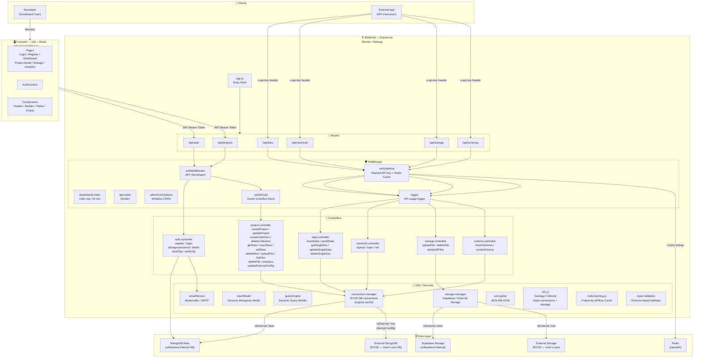
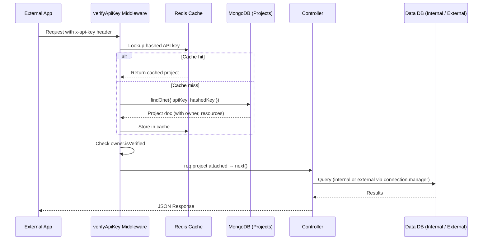
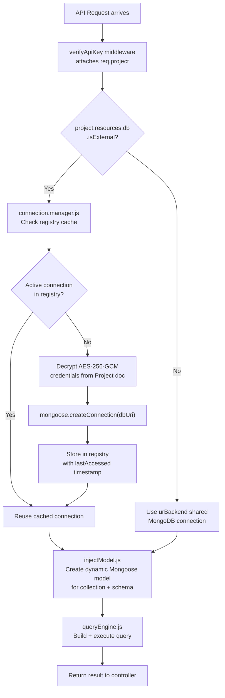
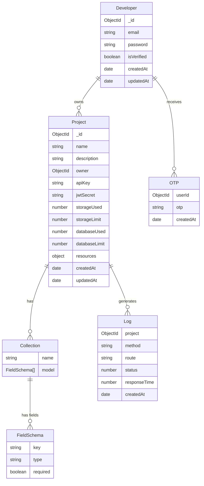
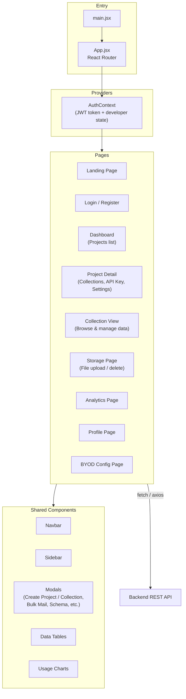
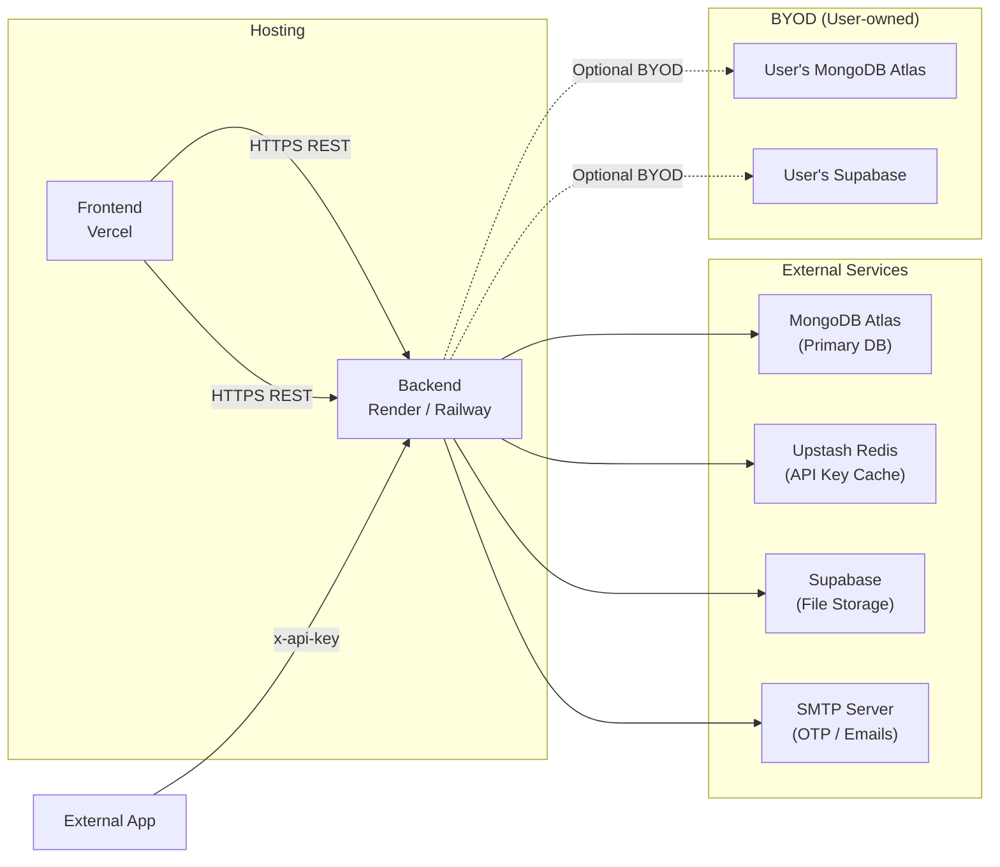

# urBackend — Architecture Diagram

## 1. System Overview

---

## 2. API Request Flow — External App (API Key)

---

## 3. BYOD (Bring Your Own Database/Storage) Flow

---

## 4. MongoDB Data Models

---

## 5. Frontend Structure (Vite + React)

---

## 6. Security & Rate Limiting

| Layer | Mechanism | Limit / Detail |
|---|---|---|
| Dashboard routes (`/api/auth`, `/api/projects`) | `dashboardLimiter` | 1000 req / 15 min |
| API consumer routes | `limiter` (custom) | Configurable |
| Developer auth | JWT (`authMiddleware`) | Bearer token, signed per dev |
| API consumer auth | `verifyApiKey` | SHA-256 hashed key + Redis cache |
| Email verification gate | `verifyEmail` | `owner.isVerified` must be `true` |
| CORS | `adminCorsOptions` | Whitelist: `urbackend.bitbros.in` only |
| Credential storage | AES-256-GCM encryption | BYOD DB/Storage configs encrypted in MongoDB |
| File uploads | `multer` memory storage | 10 MB per file limit |

---

## 7. Infrastructure Overview

