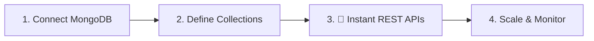

# urBackend 🚀

<p align="center">
  
</p>

<p align="center">
  <b>Bring your own MongoDB. Get a production-ready backend in 60 seconds.</b><br/>
  <i>your backend — your database — your rules.</i>
</p>

<p align="center">
  <a href="https://urbackend.bitbros.in"><strong>Dashboard</strong></a> ·
  <a href="docs/introduction.md"><strong>Docs</strong></a> ·
  <a href="docs/getting-started.md"><strong>Quick Start</strong></a> ·
  <a href="https://discord.gg/CXJjvJkNWn"><strong>Discord</strong></a>
</p>

<div align="center">


</div>

---

urBackend is an **Open-Source BaaS** built to eliminate the complexity of backend management. It provides everything you need to power your next big idea—accessible via a unified REST API.

## 🟢 Powerful Features

| Feature | Description |
| :--- | :--- |
| **Instant NoSQL** | Create collections and push JSON data instantly with zero boilerplate. |
| **Managed Auth** | Sign Up, Login, and Profile management with JWT built-in. |
| **Cloud Storage** | Managed file/image uploads with public CDN links. |
| **BYO Database** | Connect your own MongoDB Atlas or self-hosted instance. |
| **Real-time Analytics** | Monitor traffic and resource usage from a premium dashboard. |
| **Unique Constraints** | Enforce field uniqueness (e.g., username, email) at the database level. |
| **Secure Architecture** | Dual-key separation (`pk_live` & `sk_live`) for total safety. |

---

## 🚀 Quick Start

Go from zero to a live backend in **under 60 seconds**.

1.  **Initialize**: Create a project on the [Dashboard](https://urbackend.bitbros.in).
2.  **Model**: Visually define your collections and schemas.
3.  **Execute**: Push and pull data immediately using your API key.

```javascript
// Read data with a publishable key — safe to use in frontend code
const res = await fetch('https://api.ub.bitbros.in/api/data/products', {
  headers: { 'x-api-key': 'pk_live_...' }
});
const { data } = await res.json();

// Write data with a secret key — server-side only
const writeRes = await fetch('https://api.ub.bitbros.in/api/data/products', {
  method: 'POST',
  headers: {
    'x-api-key': 'sk_live_...',
    'Content-Type': 'application/json'
  },
  body: JSON.stringify({ name: 'Widget', price: 9.99 })
});
```

---

## 🔑 Key Behavior: `pk_live` vs `sk_live`

Understanding which key to use—and when—prevents the most common integration mistakes.

| Scenario | Key | Auth Token | Result |
| :--- | :--- | :--- | :--- |
| Read any collection | `pk_live` | Not required | ✅ Allowed |
| Write to a collection (RLS disabled) | `pk_live` | Any | ❌ 403 Blocked |
| Write to a collection (RLS disabled) | `sk_live` | Not required | ✅ Allowed |
| Write to a collection (RLS enabled, no token) | `pk_live` | Missing | ❌ 401 Unauthorized |
| Write to a collection (RLS enabled, wrong owner) | `pk_live` | Token with different userId | ❌ 403 Owner mismatch |
| Write to a collection (RLS enabled, correct owner) | `pk_live` | Token with matching userId | ✅ Allowed |
| Write to a collection (RLS enabled, no ownerField) | `pk_live` | Valid token | ✅ Allowed (userId auto-injected) |
| Access `/api/data/users*` | Any | Any | ❌ 403 Blocked — use `/api/userAuth/*` |

> **Rule of thumb:** `pk_live` is for frontend reads. Use `sk_live` for server-side writes, or enable collection RLS to allow authenticated users to write their own data with `pk_live`.

---

## 🛡️ Row-Level Security (RLS)

RLS lets you safely allow frontend clients to write data without exposing your secret key. When enabled on a collection, `pk_live` writes are gated by user ownership and reads can be scoped by mode.

**How it works:**

1. Enable RLS for a collection in the Dashboard and choose a mode.
2. Use `public-read` for content anyone can view, or `private` for owner-only access. (`owner-write-only` is treated as `public-read` for legacy projects.)
3. Choose the **owner field** — the document field that stores the authenticated user's ID (e.g., `userId`).
4. The client must send a valid user JWT in the `Authorization: Bearer <token>` header for `pk_live` writes and for `private` reads.
5. urBackend enforces that the JWT's `userId` matches the document's owner field.

**Example — user creates a post:**

```javascript
// 1. User logs in to get their JWT
const loginRes = await fetch('https://api.ub.bitbros.in/api/userAuth/login', {
  method: 'POST',
  headers: { 'x-api-key': 'pk_live_...', 'Content-Type': 'application/json' },
  body: JSON.stringify({ email: 'user@example.com', password: 'secret' })
});
const { token } = await loginRes.json();

// 2. User creates a post — userId is auto-injected if omitted
const postRes = await fetch('https://api.ub.bitbros.in/api/data/posts', {
  method: 'POST',
  headers: {
    'x-api-key': 'pk_live_...',
    'Authorization': `Bearer ${token}`,
    'Content-Type': 'application/json'
  },
  body: JSON.stringify({ title: 'Hello World', content: '...' })
});
// The saved document will include: { userId: '<logged-in user id>', title: 'Hello World', ... }
```

**Common failure cases:**

| Error | Cause | Fix |
| :--- | :--- | :--- |
| `403 Write blocked for publishable key` | RLS is not enabled on the collection | Enable RLS in Dashboard, or use `sk_live` |
| `401 Authentication required` | No `Authorization` header provided | Add `Authorization: Bearer <user_jwt>` |
| `403 RLS owner mismatch` | Token's `userId` ≠ document's owner field | Make sure the user is writing their own data |
| `403 Insert denied` (ownerField `_id`) | `_id` is not a valid owner field for inserts | Change ownerField to `userId` or similar |
| `403 Owner field immutable` | Trying to change the owner field on update | Remove the owner field from the PATCH/PUT body |

---

## Social Auth

Social Auth is configured in a Supabase-style flow:

1. Set your project's `Site URL` in Project Settings.
2. Open `Auth -> Social Auth` in the dashboard.
3. Copy the read-only callback URL shown for GitHub or Google.
4. Register that callback URL in the provider console.
5. Paste the provider `Client ID` and `Client Secret` into urBackend and enable the provider.

After a successful provider login, urBackend redirects users back to:
`<Site URL>/auth/callback`

GitHub and Google both support:
- linking existing users by email when the provider returns a verified email matching an existing account
- creating new users automatically when no matching account exists
- issuing the same urBackend access and refresh tokens used by normal auth flows

---

## 👤 User Authentication

User accounts are managed through `/api/userAuth/*` endpoints — **not** through the data API. Direct access to `/api/data/users*` is blocked for security.

```javascript
// Sign up a new user
POST /api/userAuth/signup
{ "email": "user@example.com", "password": "secret", "name": "Alice" }

// Log in
POST /api/userAuth/login
{ "email": "user@example.com", "password": "secret" }
// Returns: { token: "<jwt>", user: { ... } }

// Get current user profile (requires Bearer token)
GET /api/userAuth/me
Authorization: Bearer <token>
```

Both endpoints require your `pk_live` key in `x-api-key`. See the [full auth docs](docs/introduction.md#authentication) for more.

---

## 🏗️ How it Works



---

## 🏗️ Architecture

Explore our [Architecture Diagram](ARCHITECTURE_DIAGRAM.md) to understand the system design, core components, and data flow in detail.

---

## 🏠 Self-Hosting

Want to run your own instance? Follow the step-by-step guide to deploy urBackend to **Render** (backend) and **Vercel** (frontend) using free-tier services — no Docker required.

👉 **[DEPLOYMENT.md](DEPLOYMENT.md)**

---

## 🤝 Community

Join hundreds of developers building faster without the backend headaches.

- [GitHub Issues](https://github.com/yash-pouranik/urbackend/issues): Report bugs & request features.
- [Discord Channel](https://discord.gg/CXJjvJkNWn): Join the conversation.
- [Contributing](CONTRIBUTING.md): Help us grow the ecosystem.

---

## Contributors

<a href="https://github.com/yash-pouranik/urbackend/graphs/contributors">
  
</a>

Built with ❤️ by the **urBackend** community.
