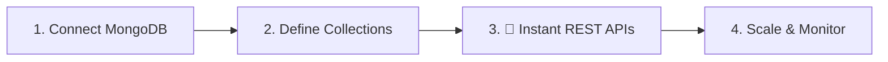

# urBackend 🚀

<p align="center">
  
</p>

<p align="center">
  <b>Bring your own MongoDB. Get a production-ready backend in 60 seconds.</b><br/>
  <i>your backend — your database — your rules.</i>
</p>

<p align="center">
  <a href="https://urbackend.bitbros.in"><strong>Dashboard</strong></a> ·
  <a href="docs/introduction.md"><strong>Docs</strong></a> ·
  <a href="https://discord.gg/CXJjvJkNWn"><strong>Discord</strong></a>
</p>

<div align="center">


</div>

---

urBackend is an **Open-Source BaaS** built to eliminate the complexity of backend management. It provides everything you need to power your next big idea—accessible via a unified REST API.

## 🟢 Powerful Features

| Feature | Description |
| :--- | :--- |
| **Instant NoSQL** | Create collections and push JSON data instantly with zero boilerplate. |
| **Managed Auth** | Sign Up, Login, and Profile management with JWT built-in. |
| **Cloud Storage** | Managed file/image uploads with public CDN links. |
| **BYO Database** | Connect your own MongoDB Atlas or self-hosted instance. |
| **Real-time Analytics** | Monitor traffic and resource usage from a premium dashboard. |
| **Secure Architecture** | Dual-key separation (`pk_live` & `sk_live`) for total safety. |

---

## 🚀 Experience the Pulse

Go from zero to a live backend in **under 60 seconds**.

1.  **Initialize**: Create a project on the [Dashboard](https://urbackend.bitbros.in).
2.  **Model**: Visually define your collections and schemas.
3.  **Execute**: Push and pull data immediately using your Instant API Key.

```javascript
// Power your UI with zero backend boilerplate
const res = await fetch('https://api.urbackend.bitbros.in/api/data/products', {
  headers: { 'x-api-key': 'your_pk_live_key' }
});
```

---

## 🏗️ How it Works (The Visual Flow)



---

## 🛠️ Infrastructure

<div align="center">

| **Core System** | **Developer UI** | **Data Layer** |
| :--- | :--- | :--- |
| Node.js & Express | React.js (Vite) | MongoDB (Mongoose) |
| JWT Authentication | Lucide React | Redis & BullMQ |
| Storage Manager | Recharts | Supabase (BYOD) |

</div>

---

## 🤝 Community

Join hundreds of developers building faster without the backend headaches.

- [GitHub Issues](https://github.com/yash-pouranik/urbackend/issues): Report bugs & request features.
- [Discord Channel](https://discord.gg/CXJjvJkNWn): Join the conversation.
- [Contributing](CONTRIBUTING.md): Help us grow the ecosystem.

---

## Contributors

<a href="https://github.com/yash-pouranik/urbackend/graphs/contributors">
  
</a>

Built with ❤️ by the **urBackend** community.
