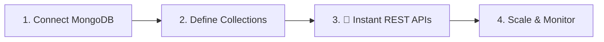

<h1 align="center">
  urBackend 🚀
</h1>

<p align="center">
  
</p>

<p align="center">
  <b>The Scalable, MongoDB-Native Open-Source Firebase Alternative.</b><br/>
  <i>your backend — your database — your rules.</i>
</p>

<p align="center">
  <a href="https://urbackend.bitbros.in"><strong>Cloud Dashboard</strong></a> ·
  <a href="https://docs.ub.bitbros.in/introduction"><strong>Docs</strong></a> ·
  <a href="https://discord.gg/CXJjvJkNWn"><strong>Discord</strong></a>
</p>

<div align="center">


[](https://github.com/geturbackend/urBackend/actions/workflows/ci.yml)


</div>

---

**urBackend** is an Open-Source Backend-as-a-Service (BaaS) built to eliminate the complexity of backend management while preserving the scaling power of Enterprise architecture (MongoDB + Redis). 

Whether you want to **self-host** in 60 seconds using Docker or use our managed **Cloud SaaS**, urBackend provides everything you need to power your next big idea via a unified REST API and gorgeous Dashboard.

## ⚡ 1-Click Local Quickstart (Docker)

Get a complete production-ready backend (API, Dashboard, MongoDB, and Redis) running locally on your machine in under 60 seconds.

```bash
# 1. Clone the repository
git clone https://github.com/yash-pouranik/urbackend.git
cd urbackend

# 2. Setup environment variables (defaults are ready for local dev!)
cp .env.example .env

# 3. Fire it up
docker-compose up -d --build
```

That's it! 🎉 
- 🌐 **Dashboard:** `http://localhost:5173`
- ⚙️ **Admin API:** `http://localhost:1234`
- 🚀 **Public API:** `http://localhost:1235`

---

## 🟢 Why urBackend?

While tools like PocketBase are great for small single-server apps (SQLite), **urBackend** is built for scale.

| Feature | urBackend | Firebase | PocketBase |
| :--- | :--- | :--- | :--- |
| **Database** | **MongoDB (Scalable)** | Proprietary NoSQL | SQLite (Single Server) |
| **Caching** | **Redis Built-in** | None | None |
| **Hosting** | **Self-Hosted / Cloud** | Cloud Only | Self-Hosted |
| **Source** | **Open-Source** | Closed-Source | Open-Source |

### Core Features:
- **Instant NoSQL:** Create collections and push JSON data instantly.
- **Managed Auth:** Sign Up, Login, and Profile management with JWT built-in.
- **Row-Level Security (RLS):** Total control over who can read/write data.
- **BYO Database:** Connect your own MongoDB Atlas or run the included local MongoDB.
- **Cloud Storage & Webhooks:** Managed uploads and real-time event triggers.

---

## 💻 Client SDKs (JavaScript & Python)

Once your backend is running, use our official SDKs to interact with it seamlessly.

1. Create a project on your local Dashboard (`localhost:5173`).
2. Install the SDK: `npm install @urbackend/sdk`
3. Start building!

### TypeScript / Node.js
```javascript
import urBackend from '@urbackend/sdk';

// Initialize with your API key
const client = urBackend({ apiKey: 'YOUR_API_KEY' });

// Read data (GET /api/data/products)
const products = await client.db.getAll('products');

// Write data (POST /api/data/products)
// requires sk_live_* key or RLS enabled
const product = await client.db.insert('products', { 
  name: 'Widget', 
  price: 9.99 
});
```

### Python
```python
from urbackend import UrBackendClient

# Initialize with your API key
client = UrBackendClient(api_key='YOUR_API_KEY')

# Read data (GET /api/data/products)
products = client.db.get_all('products')

# Write data (POST /api/data/products)
# requires sk_live_* key or RLS enabled
product = client.db.insert('products', {
    'name': 'Widget',
    'price': 9.99
})
```

---

## 🔑 Key Behavior: `pk_live` vs `sk_live`

Understanding which key to use—and when—prevents the most common integration mistakes.

| Scenario | Key | Auth Token | Result |
| :--- | :--- | :--- | :--- |
| Read any collection | `pk_live` | Not required | ✅ Allowed |
| Write to a collection (RLS disabled) | `pk_live` | Any | ❌ 403 Blocked |
| Write to a collection (RLS disabled) | `sk_live` | Not required | ✅ Allowed |
| Write to a collection (RLS enabled, no token) | `pk_live` | Missing | ❌ 401 Unauthorized |
| Write to a collection (RLS enabled, wrong owner) | `pk_live` | Token with different userId | ❌ 403 Owner mismatch |
| Write to a collection (RLS enabled, correct owner) | `pk_live` | Token with matching userId | ✅ Allowed |
| Write to a collection (RLS enabled, no ownerField) | `pk_live` | Valid token | ✅ Allowed (userId auto-injected) |
| Access `/api/data/users*` | Any | Any | ❌ 403 Blocked — use `/api/userAuth/*` |

> **Rule of thumb:** `pk_live` is for frontend reads. Use `sk_live` for server-side writes, or enable collection RLS to allow authenticated users to write their own data with `pk_live`.

---

## 🛡️ Row-Level Security (RLS)

RLS lets you safely allow frontend clients to write data without exposing your secret key. When enabled on a collection, `pk_live` writes are gated by user ownership and reads can be scoped by mode.

**How it works:**

1. Enable RLS for a collection in the Dashboard and choose a mode.
2. Use `public-read` for content anyone can view, or `private` for owner-only access. (`owner-write-only` is treated as `public-read` for legacy projects.)
3. Choose the **owner field** — the document field that stores the authenticated user's ID (e.g., `userId`).
4. The client must send a valid user JWT in the `Authorization: Bearer <token>` header for `pk_live` writes and for `private` reads.
5. urBackend enforces that the JWT's `userId` matches the document's owner field.

**Example — user creates a post:**

```javascript
// 1. User logs in (POST /api/userAuth/login)
const { accessToken } = await client.auth.login({ 
  email: 'user@example.com', 
  password: 'secret' 
});

// 2. User creates a post (POST /api/data/posts)
// accessToken is auto-handled by the SDK after login
const post = await client.db.insert('posts', { 
  title: 'Hello World', 
  content: '...' 
});
// The saved document will include: { userId: '<logged-in user id>', title: 'Hello World', ... }
```

**Common failure cases:**

| Error | Cause | Fix |
| :--- | :--- | :--- |
| `403 Write blocked for publishable key` | RLS is not enabled on the collection | Enable RLS in Dashboard, or use `sk_live` |
| `401 Authentication required` | No `Authorization` header provided | Add `Authorization: Bearer <user_jwt>` |
| `403 RLS owner mismatch` | Token's `userId` ≠ document's owner field | Make sure the user is writing their own data |
| `403 Insert denied` (ownerField `_id`) | `_id` is not a valid owner field for inserts | Change ownerField to `userId` or similar |
| `403 Owner field immutable` | Trying to change the owner field on update | Remove the owner field from the PATCH/PUT body |

## Public Signup

By default, new users can sign up using email/password or social providers. You can disable public signups from the **Authentication** page in the dashboard under the **Allow Public Signups** toggle. When disabled, the API blocks new registrations, allowing only existing users to log in.

---

## Social Auth

Social Auth is configured in a Supabase-style flow:

1. Set your project's `Site URL` in Project Settings.
2. Open `Auth -> Social Auth` in the dashboard.
3. Copy the read-only callback URL shown for GitHub or Google.
4. Register that callback URL in the provider console.
5. Paste the provider `Client ID` and `Client Secret` into urBackend and enable the provider.

After a successful provider login, urBackend redirects users back to:
`<Site URL>/auth/callback`

The frontend callback flow is:
1. Read `token` from the URL fragment and `rtCode` from the query string.
2. Call `POST /api/userAuth/social/exchange` with JSON:
   - `token`
   - `rtCode`
3. Expect a standard response in the form `{ success, data, message }`.
4. On success, store the original access token together with `data.refreshToken`.
5. Continue into the signed-in app.

Callback example:

```javascript
// After redirect from provider (POST /api/userAuth/social/exchange)
const token = new URLSearchParams(window.location.hash.slice(1)).get('token');
const rtCode = new URLSearchParams(window.location.search).get('rtCode');

const { refreshToken } = await client.auth.socialExchange({ token, rtCode });
// Success shape: { refreshToken }
```

GitHub and Google both support:
- linking existing users by email when the provider returns a verified email matching an existing account
- creating new users automatically when no matching account exists
- issuing the same urBackend access and refresh tokens used by normal auth flows
- backend-generated read-only provider callback URLs in the dashboard
- redirecting to the project `Site URL` after provider login

---

## 👤 User Authentication

User accounts are managed through the SDK's `auth` module — **not** through the database API. Direct access to `/api/data/users*` is blocked for security.

```javascript
// Sign up a new user (POST /api/userAuth/signup)
await client.auth.signUp({ 
  email: "user@example.com", 
  password: "secret", 
  name: "Alice" 
});

// Log in (POST /api/userAuth/login)
const { accessToken, user } = await client.auth.login({ 
  email: "user@example.com", 
  password: "secret" 
});

// Get current user profile (GET /api/userAuth/me)
// Uses the accessToken from the previous login automatically
const me = await client.auth.me();
```

All auth methods require your `pk_live` key. See the [full auth docs](docs/introduction.md#authentication) for more.

---

## 🏗️ How it Works


```mermaid
graph LR
    A[1. Connect MongoDB] --> B[2. Define Collections]
    B --> C[3. 🚀 Instant REST APIs]
    C --> D[4. Scale & Monitor]
```

---

## 🏗️ Architecture

Explore our [Architecture Diagram](ARCHITECTURE_DIAGRAM.md) to understand the system design, core components, and data flow in detail.

---

## 🏠 Self-Hosting

Want to run your own instance? Follow the step-by-step guide to deploy urBackend to **Render** (backend) and **Vercel** (frontend) using free-tier services — no Docker required.

👉 **[DEPLOYMENT.md](DEPLOYMENT.md)**

---

## 🤝 Community

Join hundreds of developers building faster without the backend headaches.

- [GitHub Issues](https://github.com/yash-pouranik/urbackend/issues): Report bugs & request features.
- [Discord Channel](https://discord.gg/CXJjvJkNWn): Join the conversation.
- [Contributing](CONTRIBUTING.md): Help us grow the ecosystem.

---

---

## Star History

<a href="https://www.star-history.com/?repos=geturbackend%2Furbackend&type=date&legend=top-left">
 <picture>
   <source media="(prefers-color-scheme: dark)" srcset="https://api.star-history.com/chart?repos=geturbackend/urbackend&type=date&theme=dark&legend=top-left&sealed_token=VTbNJ1rS4Fq_k6YQoVaM2J0-P6RWGeAex7HyMG7Ee3xVgBKErBdMdCmuu9VghFfsK4jvoKpTme7EtLapuh_c6caqco1wSN9XYWButE0E5F9VvvOD8ZP_bQ" />
   <source media="(prefers-color-scheme: light)" srcset="https://api.star-history.com/chart?repos=geturbackend/urbackend&type=date&legend=top-left&sealed_token=VTbNJ1rS4Fq_k6YQoVaM2J0-P6RWGeAex7HyMG7Ee3xVgBKErBdMdCmuu9VghFfsK4jvoKpTme7EtLapuh_c6caqco1wSN9XYWButE0E5F9VvvOD8ZP_bQ" />
   
 </picture>
</a>s

---

## Contributors

<a href="https://github.com/yash-pouranik/urbackend/graphs/contributors">
  
</a>

Built with ❤️ by the **urBackend** community.
.
.
